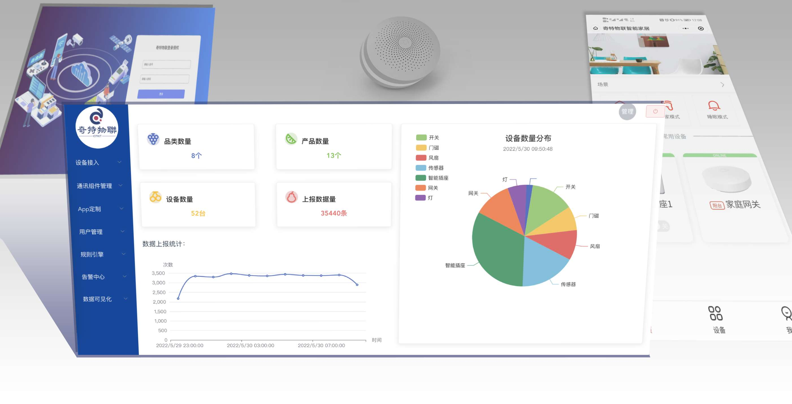

       

 
 

#### 介绍
此仓库为奇特物联(iotkit)物联网平台开源项目。
奇特物联是一个开源的物联网基础开发平台，提供了物联网及相关业务开发的常见基础功能, 能帮助你快速搭建自己的物联网相关业务平台。

系统包含了品类、物模型、消息转换、通讯组件（mqtt/EMQX通讯组件、小度音箱接入组件、onenet Studio接入组件）、云端低代码设备开发、设备管理、设备分组、规则引擎、第三方平台接入、数据流转、数据可视化、报警中心等模块和智能家居APP（小程序），集成了[Sa-Token](https://gitee.com/dromara/sa-token) 认证框架。

#### 支持数据库

关系型数据库：理论上支持所有实现了标准SQL的数据库，如： DB2、H2、HSQLDB、MariaDB、Microsoft SQL Server、MySQL、Oracle、Postgres

时序数据库：elasticsearch、TDEngine

**前端项目见：** https://gitee.com/iotkit-open-source/iot-console-web

 **演示地址：** [演示地址](http://120.76.96.206)，账号：guest1,密码：guest123  (只读权限)

 **智能家居小程序：** https://gitee.com/iotkit-open-source/iot-mp-home ，微信搜索小程序： 奇特物联

 **小度接入：** 小度APP添加设备中搜索 奇特物联

**系统截图**

#### 软件架构
软件架构说明
本系统采用springboot、redis、H2、mysql、elasticsearch、sa-token等框架和第三方软件。

默认使用内置的redis、h2数据库、es时序数据库和消息总线以减小启动难度，可实现 **零配置一键启动** ，程序在第一次启动的时候会使用data/init目录的示例数据进行初始化。

管理员账号密码：iotkit/iotkitadmin

**注：** es版本为7.15.2，mysql版本为8.0+

##### 关系数据库切换为mysql方法（其它数据库同理）

1、将iot-rdb-data-service/pom.xml中的mysql驱动注释放开

2、启动时指定active: --spring.profiles.active=mysql

##### 时序数据库切换为TDengein方法(feature分支)

1、注释掉iot-standalone/pom.xml中的 iot-es-temporal-service，并打开iot-td-temporal-service的注释

2、application.xml中注释掉elasticsearch配置，并打开td-datasource配置

#### 运行步骤
1、安装jdk11

2、clone代码，在idea中导入项目

3、在iot-standalone模块的Application类上右键运行

4、若出现报错，可能是数据没有初始化完，把项目根目录下.init文件删除后重启

#### docker运行
git clone https://gitee.com/iotkit-open-source/iotkit-parent.git && cd iotkit-parent/docker-compose && docker-compose up -d 

#### 技术文档

https://ztktkv.yuque.com/books/share/b96f1fee-41d8-4da3-9e22-b73aeb1e29ed?# 《iot平台技术文档》密码：rf4d    (注意：不要登录语雀)

    
 **这是我宝贵的技术文档分享，请给本仓库点个star**   :star:  **支持一下，谢谢！**  :star:  :star:  :star:  :star: 

#### 捐助与支持
如果您觉得我的开源软件对你有所帮助请关注、star、fork :kissing_heart: 。

如果我的开源软件应用到您的商业项目中，请务必通知到我，因为得到用户的认可是支撑开源的动力。

交流QQ群: 940575749

微信群:

### roadmap

绿色:已完成,蓝色:进行中,橙色:规划中

