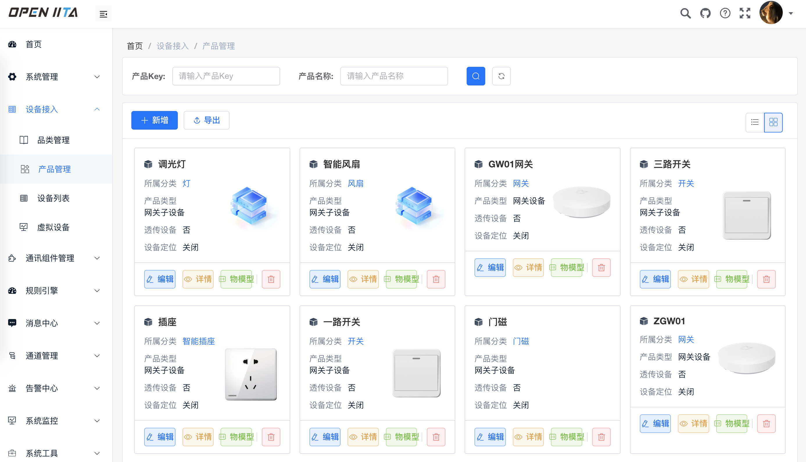
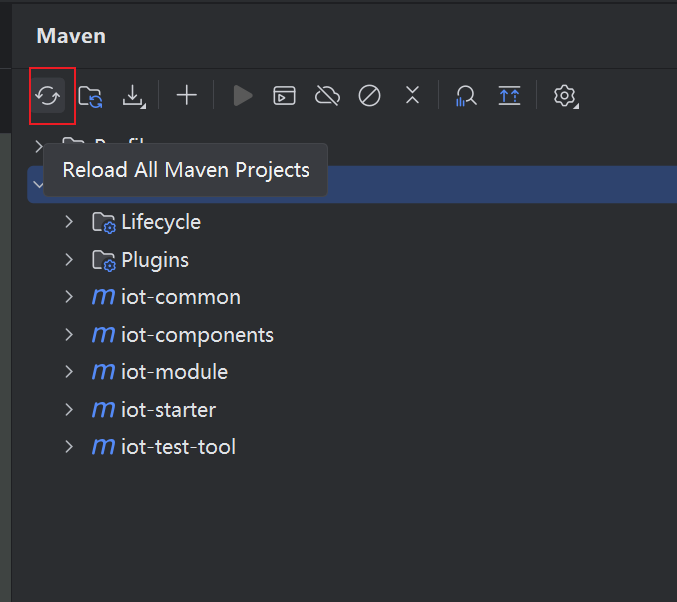
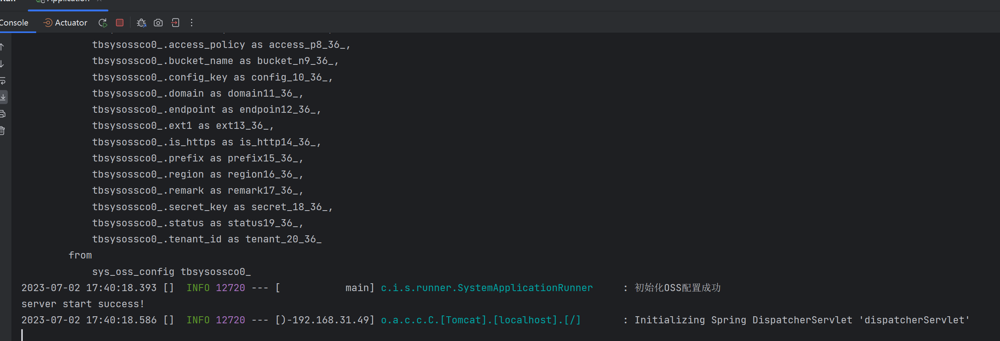
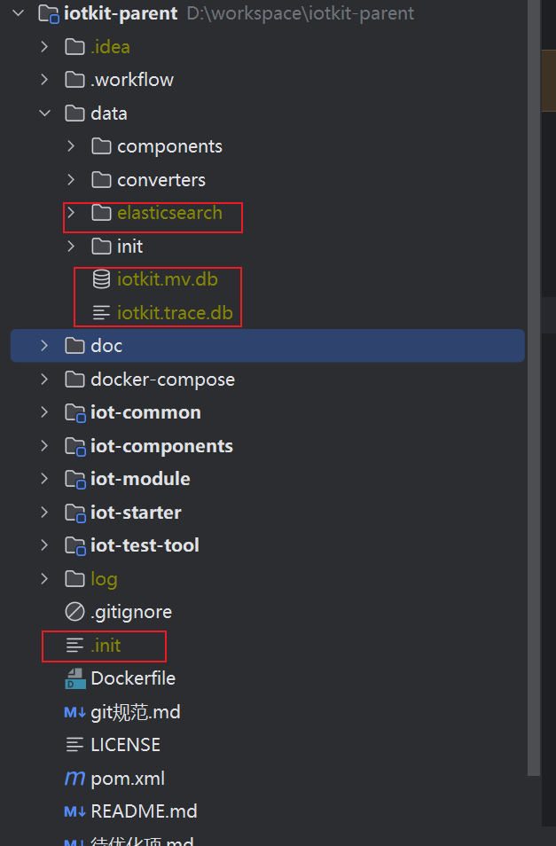

<p align="center">

</p>
<p align="center">       
</p>
<p align="center"> 
 

</p>

#### 介绍
此仓库为铱塔智联(openiita)物联网平台开源项目。
铱塔智联开源平台是一个开源的物联网基础开发平台，提供了物联网及相关业务开发的常见基础功能, 能帮助你快速搭建自己的物联网相关业务平台。

系统包含了品类、物模型、消息转换、通讯组件（mqtt/EMQX通讯组件、小度音箱接入组件、onenet Studio接入组件）、modbus透传接入、云端低代码设备开发、设备管理、设备分组、规则引擎、第三方平台接入、数据流转（http/mqtt/kafka）、数据可视化、报警中心等模块和智能家居APP（小程序）。

#### 低配服务器万级设备接入能力

服务器配置： 1台2核2G(阿里云突发性能实例)跑主程序、1台2核4G(阿里云突发性能实例)跑TDengine和RocketMq

程序配置：使用内置H2数据库和内置mqtt

设备接入情况：接入4千台网关+8千台子设备，其中4千台子设备每10秒上报一条数据

稳定运行后：设备在线并正常上报和下发、CPU占用未超过50%、界面操作没有卡顿

#### 低学习门槛

1、零配置一键运行，小白也会用

2、低环境要求，不需要额外安装软件

3、平民级代码，没有形式化的分层和过度封装，简单易懂


#### 主流数据库支持

关系型数据库：理论上支持所有实现了标准SQL的数据库，如： DB2、H2、HSQLDB、MariaDB、Microsoft SQL Server、MySQL、Oracle、Postgres

时序数据库：elasticsearch、TDEngine

K-V数据库：redis

#### 消息总线支持

Vertx event-bus（内置）、RocketMQ，通过扩展模块可接入其它任意消息中间件。


#### 系统生态

**前端项目：** 

[](https://gitee.com/open-iita/iita-iot-web-admin)

 **演示地址：** [点击访问](http://159.75.222.119:16808)


**系统截图**

 


#### 软件架构
软件架构说明
本系统采用springboot、jpa、vertx、redis、H2、mysql、elasticsearch、TDEngine、RocketMq、sa-token等框架和第三方软件，中间件采用模块化无侵入集成非常容易扩展和替换。

默认使用内置的redis、h2数据库、es时序数据库和vertx消息总线以减小启动难度，可实现 **零配置一键启动** ，程序在第一次启动的时候会使用data/init目录的示例数据进行初始化。

管理员账号密码：admin/admin123

**注：** es版本为7.15.2，mysql版本为8.0+

##### H2数据库切换为mysql方法（其它数据库同理）
1、删掉.init、iotkit.mv.db、iotkit.trace.db文件

2、将iot-data-serviceImpl-rdb/pom.xml中的mysql驱动注释放开

3、application.yml 注释掉内置H2数据库，打开mysql配置注释

##### es切换为TDengine(版本：3.x)方法
1、删掉.init和关系数据库数据

2、注释掉iot-starter/pom.xml中的 iot-temporal-serviceImpl-es，并打开iot-td-temporal-service的注释

3、注解掉iot-starter下application.xml中的elasticsearch配置，并打开td-datasource配置

##### 消息总线切换为RocketMq方法

1、注释掉iot-starter/pom.xml中的 iot-message-event-bus，并打开iot-message-rocketmq的注释

2、application.xml中打开rocketmq配置

#### 项目结构
```

├data	初始化数据
│  ├components
│  ├converters
│  ├init
├doc
├docker-compose
├iot-common	基础框架
│  ├iot-common-core
│  ├iot-common-dao
│  ├iot-common-doc
│  ├iot-common-excel
│  ├iot-common-log
│  ├iot-common-oss
│  ├iot-common-redis
│  ├iot-common-satoken
│  ├iot-common-tenant
│  ├iot-common-web
│  ├iot-common-websocket
│  ├iot-message-bus
│  ├iot-script-engine
├iot-components	通讯组件
│  ├iot-component-base	
│  ├iot-component-converter
│  ├iot-component-oss
│  ├iot-component-server
│  ├iot-component-tcp
│  ├iot-ctwing-component
│  ├iot-DLT645-component
│  ├iot-emqx-component
│  ├iot-http-biz-component
│  ├iot-mqtt-component
│  ├iot-websocket-component
├iot-module	业务模块
│  ├iot-generator	代码生成
│  ├iot-manager	管理业务
│  ├iot-message-notify	消息转发
│  ├iot-rule-engine	规则引擎
│  ├iot-screen	数据大屏
│  ├iot-system	通用菜单权限管理
├iot-starter	启动包
├iot-test-tool	测试模块
│  ├iot-test-mqtt
│  ├iot-virtual-device

```

#### 运行步骤
1、安装jdk11

2、clone代码，在idea中导入项目

3、在iot-starter模块的Application类上右键运行

4、若出现报错，可能是数据没有初始化完或重复初始化，把项目根目录下.init文件和data/iotkit.xx文件删除后重启

在配置好相应的jdk11环境后，推荐使用idea拉取代码，等待项目加载完成以后，先在Terminal里执行mvn clean install，然后在idea的maven操作框上点击下刷新


然后就点击启动，看到如下所示日志即表示启动成功：



#### 后端常见问题以及处理方式

#### 1、数据初始化不成功

删除以下标红的几个文件以及文件夹后，重复下上面启动项目的操作：



切换成外置中间件数据库时，也注意删除相关库以及数据。

##### 2、提示找不到QTbxxxxx类

在Terminal里执行mvn clean install，再刷新下，这个出现的原因是因为采用了querydsl插件，打包时会生成相关的类，有可能idea的扫描不及时，导致未识别到


##### 3，启动提示xxMapperxxx类bean重复

处理办法同2一样，原因也类似，采用了mapstruct plus插件，打包时候会生成对应类的getset方法工具类，可能idea的扫描不及时，导致未识别到


#### 服务器部署

执行maven打包在iot-starter模块中将打包后的iot-starter.xx.zip上传到服务器，解压后进入bin目录，执行start.sh或start.bat启动。


#### 文档

http://iotkit-open-source.gitee.io/document/


#### 捐助与支持
如果您觉得我的开源软件对你有所帮助请关注、star、fork :kissing_heart: 。

如果我的开源软件应用到您的商业项目中，请务必通知到我，因为得到用户的认可是支撑开源的动力。

交流QQ群: 940575749

微信群(添加我微信备注"进群"):

 


#### 开源生态

1. [mybatis-plus版数据服务](https://gitee.com/openiot/iotkit-parent-mybatis)（直接替换iot-data-serviceImpl-rdb就能从jpa切换成mybatis-plus）


### 项目规划

见：《[开源项目管理](https://open-iita.feishu.cn/base/G4owbWqkbaoI0LsYVnWcreXVnnc)》


