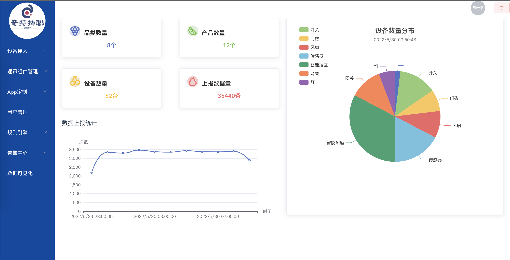

# iotkit-parent

#### 介绍
此仓库为奇特物联(iotkit)物联网平台开源项目。
奇特物联是一个开源的物联网基础开发平台，提供了物联网及相关业务开发的常见基础功能, 能帮助你快速搭建自己的物联网相关业务平台。

系统包含了品类、物模型、消息转换、通讯组件（mqtt通讯组件、小度音箱接入组件、onenet Studio接入组件）、云端低代码设备开发、设备管理、规则引擎、第三方平台接入、数据流转、数据可视化、报警中心等模块和智能家居APP（小程序），集成了[Sa-Token](https://gitee.com/dromara/sa-token) 认证框架。

 **前端项目见：** https://gitee.com/iotkit-open-source/iot-console-web

 **演示地址：** [演示地址](http://120.76.96.206)，账号：guest1,密码：guest123  (只读权限)

 **智能家居小程序：** https://gitee.com/iotkit-open-source/iot-mp-home 


 **系统截图** 




#### 软件架构
软件架构说明
本系统采用springboot、mongodb、redis、elasticsearch、pulsar、sa-token等框架和第三方软件


#### 安装教程

 **application-dev.yml配置：** 

```
server:
  port: 8086

spring:
  servlet:
    multipart:
      enabled: true
      max-file-size: 10MB
      max-request-size: 12MB

  #mongodb数据库配置
  data:
    mongodb:
      uri: mongodb://填写mongodb地址
      database: iotkit

  elasticsearch:
    rest:
      #使用内置es的配置
      uris: http://127.0.0.1:9200
      username: 
      password: 
      connection-timeout: 10s

  redis:
    #使用内置redis的配置
    host: 127.0.0.1
    port: 6379
    database: 0
    password: 

  mvc:
    pathmatch:
      matching-strategy: ant_path_matcher

#图片存储用的是阿里云oss，如果需要上传产品图片才需要配置
aliyun:
  bucketId: 填写阿里云bucketId
  endpoint: oss-cn-shenzhen.aliyuncs.com
  accessKeyId: 填写阿里云accessKeyId
  accessKeySecret: 填写阿里云accessKeySecret

sa-token:
  # token名称 (同时也是cookie名称)
  token-name: satoken
  # token有效期，单位s 默认30天, -1代表永不过期
  timeout: 2592000
  # token临时有效期 (指定时间内无操作就视为token过期) 单位: 秒
  activity-timeout: -1
  # 是否允许同一账号并发登录 (为true时允许一起登录, 为false时新登录挤掉旧登录)
  is-concurrent: true
  # 在多人登录同一账号时，是否共用一个token (为true时所有登录共用一个token, 为false时每次登录新建一个token)
  is-share: false
  # token风格
  token-style: uuid
  # 是否输出操作日志
  is-log: false

#pulsar消息队列配置，需要进行配置
pulsar:
  broker: pulsar://pulsar broker地址:6650
  service: http://pulsar 服务地址:8080

#认证中心地址
oauth2:
  auth-server-url: http://127.0.0.1:8086
  

```

 **启用内置es和redis配置** 
增加启动参数

```
embeddedElasticSearch=true
embeddedRedisServer=true
```

如idea中：


 **mongodb数据库示例脚本** 

请加QQ或微信群获取


以上，最小配置项：pulsar消息队列配置、mongodb数据库配置。

monogodb和pulsar安装配置见末尾。


#### 使用说明

1.  技术文档
    邀你加入「iot平台技术文档」知识库: https://ztktkv.yuque.com/g/ztktkv/gb3v6g/collaborator/join?token=zz5PUmXzGQqc4h9t# 
    
      **这是我宝贵的技术文档分享，请给本仓库点个star :sparkles: 支持一下，谢谢！** 
2.  系统操作说明

 **开启MQTT标准协议接入功能** 

在消息转换器管理中编辑”奇特MQTT标准协议“，编辑转换脚本（示例脚本进群获取）。

启用MQTT标准协议组件：

在组件管理中修改”MQTT标准协议组件“，上传组件jar包，将mqtt-component项目执行打包生成的mqtt-component-xx.jar上传，然后再编写脚本（示例脚本进群获取），然后点击”状态“启用组件。

 **使用模拟器进行设备测试** 

启动项目中的mqtt-client-simulator模拟器，模拟设备接入系统


#### 待办事项
- ->告警中心
- 数据大屏


#### 捐助与支持
如果您觉得我的开源软件对你有所帮助请打个赏，1元钱也是爱。

如果我的开源软件应用到您的商业项目中，请务必通知到我，因为得到用户的认可是支撑开源的动力。

交流QQ群: 940575749 

微信群:

 


  **mongodb安装配置** 


 **Pulsar安装配置** 


